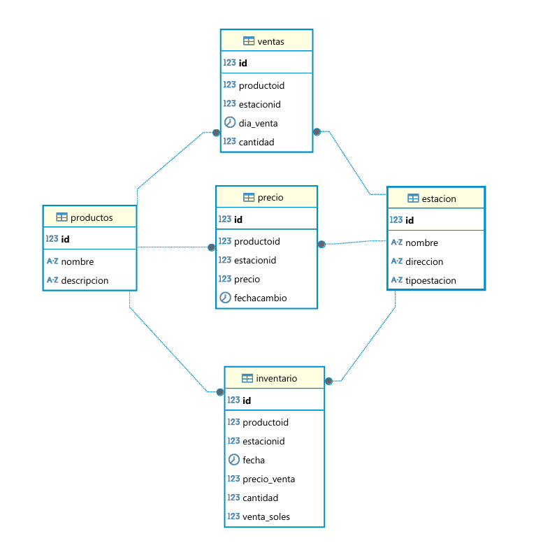

# Sistema de Control de Inventario y Ventas de Gasolina

Este proyecto automatiza el registro diario de inventario y ventas de combustibles para múltiples estaciones de servicio. Incluye carga de datos desde archivos Excel, almacenamiento en MariaDB, generación de reportes en PDF y respaldo automático de la base de datos.

## 🔧 Funcionalidades

- ✅ Carga automatizada de archivos Excel por estación.
- ✅ Registro de productos: GLP, PREMIUM, REGULAR y DB5.
- ✅ Inserción en base de datos MariaDB.
- ✅ Generación de reportes PDF diarios por estación.
- ✅ Diagrama de flujo del proceso.
- ✅ Script de respaldo (`backup.sh`) para la base de datos.

## 🛠 Tecnologías

- Python 3.11
- MariaDB
- Pandas
- openpyxl
- ReportLab
- Bash (para backups)

## 📂 Estructura del Proyecto

```
gasolinas/
├── estaciones/               # Archivos Excel por estación
├── src/                      # Código fuente
│   ├── cargar_excel.py       # Script para cargar datos desde Excel
│   ├── generar_pdf.py        # Script para generar reporte en PDF
│   ├── backup.sh             # Script para hacer backup de la BD
├── imagenes/
│   └── diagrama_flujo.png    # Diagrama de flujo del sistema
├── reports/                  # Reportes PDF generados
├── backups/                  # Backups de la base de datos
├── README.md
├── requirements.txt
└── crear_tablas.sql          # Script para crear estructura de la base de datos
```

## 📥 Instalación

1. Clonar el repositorio:

```bash
git clone https://github.com/usuario/gasolinas.git
cd gasolinas
```

2. Crear entorno virtual y activar:

```bash
python -m venv venv
source venv/bin/activate  # Windows: venv\Scripts\activate
```

3. Instalar dependencias:

```bash
pip install -r requirements.txt
```

4. Configurar base de datos:

- Crear base de datos `gasolinas1` en MariaDB.
- Ejecutar `crear_tablas.sql` para crear las tablas.

## 🚀 Uso

### Cargar datos desde Excel:

```bash
python src/cargar_excel.py estaciones/LaRinconada.xlsx

```

### Generar reporte PDF:

```bash
python src/generar_pdf.py LaRinconada 2025-06-10
```

### Ejecutar backup de base de datos:

```bash
bash src/backup.sh
```

> Los reportes se guardan en `reports/` y los backups en `backups/`.

## 🧭 Diagrama de Flujo



## 🧾 Ejemplo de Archivo Excel

| PRODUCTO | CANTIDAD GALONES | PRECIO VENTA | VENTA SOLES |
|----------|------------------|--------------|--------------|
| GLP      | 500              | 3.85         | 1925         |
| REGULAR  | 600              | 4.95         | 2970         |

## 🛡️ Respaldo Automático

El script `backup.sh` guarda una copia de seguridad de la base de datos con marca de tiempo. Puede programarse con `cron` para ejecución diaria.

## 🧑‍💻 Autor

Desarrollado por [ FREDY APOLINARIO ALCOCER].

## 📄 Licencia

Licencia MIT. Puedes usar y modificar libremente este proyecto.
